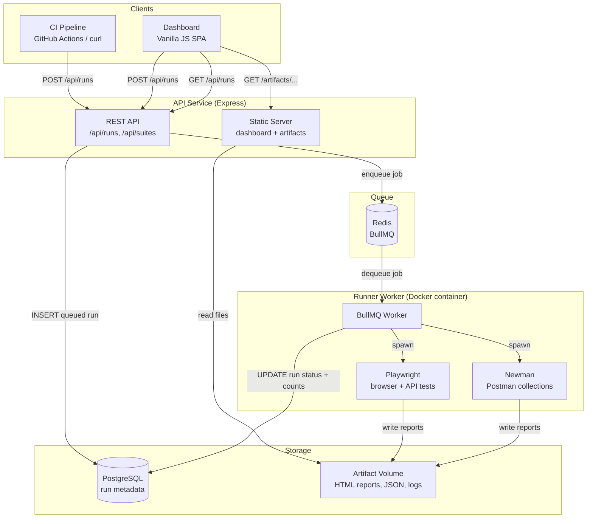
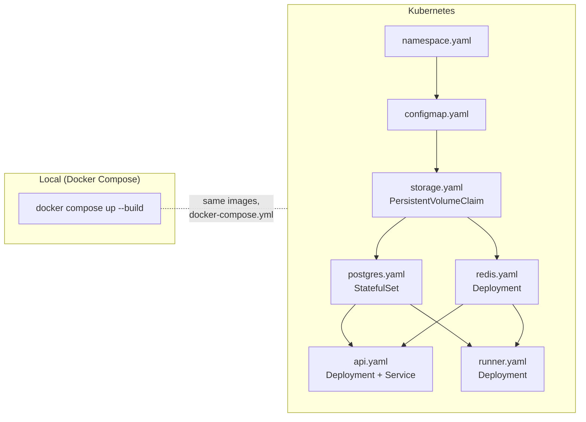

# SmokeStack

A lightweight, containerised QA execution platform. Trigger automated test suites on demand, track results, and view reports — all from a single dashboard.

```
docker compose up --build
```

Open **http://localhost:3000**

---

## What it does

- Trigger Playwright or Newman test suites via the dashboard or REST API
- Executes tests inside an isolated container with no setup required
- Streams live logs and stores pass/fail counts per run
- Links to HTML reports, JSON results, and raw logs as artifacts
- Auto-refreshes run status every few seconds

---

## Architecture



The API never blocks on test execution. It creates a `queued` run record and returns immediately. The runner picks up the job asynchronously, executes the tests, then writes results and artifacts back.

### Deployment targets



---

## Stack

| Layer | Technology |
|-------|-----------|
| API | Node.js + Express |
| Queue | Redis + BullMQ |
| Database | PostgreSQL 16 |
| Runner base image | `mcr.microsoft.com/playwright:v1.42.0-jammy` |
| Browser testing | Playwright 1.42 |
| API testing | Newman + newman-reporter-htmlextra |
| Dashboard | Vanilla HTML/CSS/JS (zero build step) |
| Infrastructure | Docker + Docker Compose |
| Orchestration | Kubernetes (manifests in `k8s/`) |

---

## Running locally

**Requirements:** Docker Desktop

```bash
# First run (builds images — takes 5–10 min for the Playwright base image)
docker compose up --build

# Subsequent runs
docker compose up
```

Dashboard: **http://localhost:3000**

To wipe all data and start fresh:
```bash
docker compose down -v
```

---

## Project structure

```
smokestack/
├── api/                        # Express API + dashboard static files
│   ├── src/
│   │   ├── index.js            # App entry, routes, static middleware
│   │   ├── db.js               # PostgreSQL pool
│   │   ├── queue.js            # BullMQ producer
│   │   ├── suites.js           # Suite registry (API side)
│   │   └── routes/runs.js      # /api/runs endpoints
│   └── public/                 # Dashboard (index.html, app.js, style.css)
│
├── runner/                     # BullMQ worker
│   └── src/
│       ├── worker.js           # Worker entry point
│       ├── processor.js        # Job handler (mkdir → run → parse → persist)
│       ├── executor.js         # Spawns playwright / newman processes
│       ├── suites.js           # Suite registry (runner side)
│       └── db.js               # PostgreSQL pool
│
├── examples/                   # Example test suites (mounted into runner)
│   ├── playwright-demo/        # 5 UI tests + 6 API tests
│   └── newman-demo/            # 7 API tests (Postman collection)
│
├── postgres/
│   └── init.sql                # Creates the `runs` table
│
├── k8s/                        # Kubernetes manifests
│   ├── namespace.yaml
│   ├── configmap.yaml
│   ├── postgres.yaml
│   ├── redis.yaml
│   ├── api.yaml
│   ├── runner.yaml
│   ├── storage.yaml
│   └── ingress.yaml
│
└── docker-compose.yml
```

---

## API

### Trigger a run

```
POST /api/runs
Content-Type: application/json

{
  "suite": "playwright-demo",
  "environment": "staging"
}
```

Response:
```json
{
  "id": "2bcaa19b-967b-4dd6-acca-fae640ac0367",
  "suite": "playwright-demo",
  "environment": "staging",
  "status": "queued",
  "created_at": "2026-03-13T06:00:00.000Z"
}
```

### List runs

```
GET /api/runs?limit=50&offset=0&status=passed
```

### Get a run

```
GET /api/runs/:id
```

Response includes: `status`, `total_tests`, `passed_tests`, `failed_tests`, `duration_ms`, `artifact_path`, `error_message`

### Get logs

```
GET /api/runs/:id/logs
```

### Available suites

```
GET /api/suites
```

### Artifacts

Artifacts are served directly by the API:

```
GET /artifacts/:runId/html-report/index.html   # Playwright HTML report
GET /artifacts/:runId/report.html              # Newman HTML report
GET /artifacts/:runId/results.json             # JSON results
GET /artifacts/:runId/run.log                  # Raw stdout/stderr
```

---

## Example suites

### playwright-demo

Playwright tests split across two files:

- `tests/smoke.spec.js` — 5 UI tests on [playwright.dev](https://playwright.dev): homepage title, "Get started" CTA, navigation, sidebar, search
- `tests/api.spec.js` — 6 API tests on [jsonplaceholder.typicode.com](https://jsonplaceholder.typicode.com): GET posts, GET single post, POST create, filter by userId, GET users, 404 handling

### newman-demo

Newman collection with 7 requests across 3 folders against [jsonplaceholder.typicode.com](https://jsonplaceholder.typicode.com):

- **Posts** — GET all, GET one, POST create, GET with filter
- **Users** — GET all, GET one
- **Todos** — GET incomplete

Each request has inline test assertions for status codes, response shape, and response time.

---

## Adding a new suite

**1. Create the suite files** under `examples/your-suite/`

**2. Register it in both `api/src/suites.js` and `runner/src/suites.js`:**

```js
// api/src/suites.js
'your-suite': {
  id: 'your-suite',
  name: 'Your Suite',
  description: 'What it tests',
  type: 'playwright', // or 'newman'
}

// runner/src/suites.js
'your-suite': {
  type: 'playwright',
  cwd: '/suites/your-suite',
}
```

**3. For Playwright suites**, include a `playwright.config.js` that reads `process.env.ARTIFACT_DIR` for output paths (see `examples/playwright-demo/playwright.config.js`).

**4. For Newman suites**, include a `collection.json` in the suite directory. An optional `environment.json` is loaded automatically if present.

No rebuild needed for new suites — the `examples/` directory is mounted as a live volume.

---

## Kubernetes

For local Kubernetes development using [kind](https://kind.sigs.k8s.io/):

```bash
# Create cluster
kind create cluster --name smokestack

# Load locally-built images
kind load docker-image smokestack-api:latest --name smokestack
kind load docker-image smokestack-runner:latest --name smokestack

# Deploy
kubectl apply -f k8s/

# Check pods
kubectl get pods -n smokestack

# Expose dashboard
kubectl port-forward service/smokestack-api-svc 3000:80 -n smokestack
```

---

## Roadmap

- [ ] Flaky test detection (flag tests that pass/fail inconsistently across runs)
- [ ] Historical pass rate charts per suite
- [ ] Slack / webhook notifications on failure
- [ ] Environment variable injection per run
- [ ] Tag-based test selection
- [ ] Prometheus metrics endpoint
- [ ] S3 / MinIO artifact storage backend
- [x] GitHub Actions CI integration
