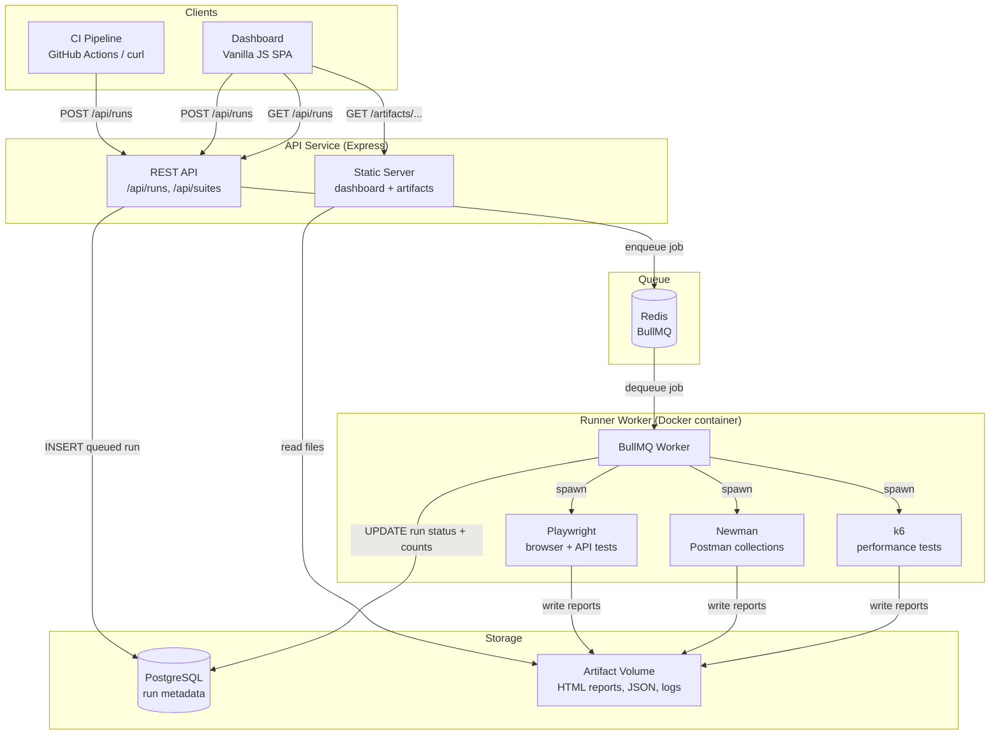
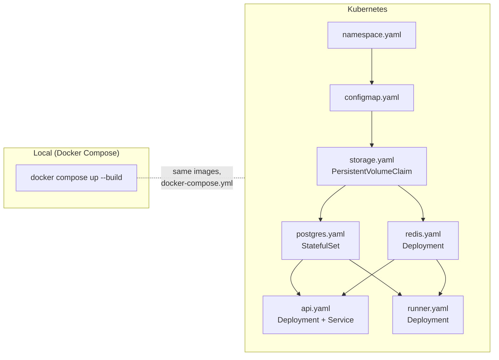

# SmokeStack

[](https://github.com/jcopperman/smokestack/actions/workflows/ci.yml)
[](https://playwright.dev)
[](https://k6.io)
[](LICENSE)

SmokeStack is a self-hosted test execution platform for automated QA suites. It lets teams trigger browser, API, and performance tests from a dashboard or CI pipeline and centralizes results, logs, and HTML reports in one place.

Runs are queued and executed asynchronously — the API returns immediately, and a worker container picks up the job, executes the suite, and writes results back when complete.

```bash
docker compose up --build
```

Open **http://localhost:3000**

---

## Why SmokeStack

Automated tests often live scattered across local machines, CI jobs, and tool-specific dashboards — making it hard to get a consistent view of suite health across environments. SmokeStack provides a lightweight execution layer that centralizes test triggering, run history, and artifact storage in one place. Any team member, CI pipeline, or deployment script can trigger a suite via a single API call and retrieve structured results without knowing how the tests are set up internally. It's designed to be self-hosted, easy to extend, and straightforward to integrate into an existing workflow.

---

## Highlights

- Trigger Playwright, Newman, and k6 suites from a dashboard or REST API
- Execute runs asynchronously via a Redis + BullMQ job queue
- Store run history and pass/fail counts in PostgreSQL
- Serve HTML reports, JSON results, and raw logs per run
- Tag runs with an environment name (`staging`, `production`, etc.)
- Integrate with CI pipelines as a release gate
- Run locally with Docker Compose or deploy to Kubernetes

---

## Supported test types

| Type | Tool | Best for |
|---|---|---|
| Browser / E2E | [Playwright](https://playwright.dev) | UI flows, navigation, visual checks |
| API functional | [Newman](https://learning.postman.com/docs/collections/using-newman-cli/command-line-integration-with-newman/) (Postman collections) | Contract testing, endpoint assertions |
| Performance / load | [k6](https://k6.io) | Throughput, latency thresholds, error rates |

---

## Quick start

**Requirements:** Docker Desktop

```bash
# First run — builds images (5–10 min, Playwright base image is large)
docker compose up --build

# Subsequent runs
docker compose up
```

Open **http://localhost:3000**, click **▶ New Run**, choose a suite and environment, and hit **Run Suite**.

To wipe all run history and artifacts:
```bash
docker compose down -v
```

---

## Triggering a run

### From the dashboard

Click **▶ New Run** in the top-right corner, select a suite and environment, and submit.

### From the CLI

```bash
curl -X POST http://localhost:3000/api/runs \
  -H "Content-Type: application/json" \
  -d '{"suite": "playwright-demo", "environment": "staging"}'
```

Response:
```json
{
  "id": "2bcaa19b-967b-4dd6-acca-fae640ac0367",
  "suite": "playwright-demo",
  "environment": "staging",
  "status": "queued",
  "created_at": "2026-03-13T06:00:00.000Z"
}
```

Poll until complete:
```bash
curl http://localhost:3000/api/runs/2bcaa19b-967b-4dd6-acca-fae640ac0367
```

### From GitHub Actions (release gate)

```yaml
- name: Trigger smoke tests
  run: |
    RUN_ID=$(curl -sf -X POST "$SMOKESTACK_URL/api/runs" \
      -H "Content-Type: application/json" \
      -d '{"suite":"smoke","environment":"staging"}' | jq -r .id)

- name: Wait for result
  run: |
    for i in $(seq 1 60); do
      STATUS=$(curl -sf "$SMOKESTACK_URL/api/runs/$RUN_ID" | jq -r .status)
      [ "$STATUS" = "passed" ] && exit 0
      [ "$STATUS" = "failed" ] || [ "$STATUS" = "error" ] && exit 1
      sleep 5
    done
```

See [.github/workflows/release-gate.yml](.github/workflows/release-gate.yml) for the full template.

---

## Reading results

Each run produces:

| Field | Meaning |
|---|---|
| `status` | `queued` → `running` → `passed` / `failed` / `error` |
| `total_tests` | Total assertions or checks executed |
| `passed_tests` | Assertions that passed |
| `failed_tests` | Assertions that failed |
| `duration_ms` | Total wall-clock time for the run |

**Artifacts** are accessible directly from the dashboard or via URL:

| Artifact | URL |
|---|---|
| Playwright HTML report | `/artifacts/:runId/html-report/index.html` |
| Newman HTML report | `/artifacts/:runId/report.html` |
| JSON results | `/artifacts/:runId/results.json` |
| Raw log output | `/artifacts/:runId/run.log` |

---

## Example suites

Three example suites are included and run out of the box.

### playwright-demo

Browser and API tests using Playwright against public test sites. Covers UI navigation, element visibility, and REST API assertions across 11 tests.

### newman-demo

Postman collection run via Newman against [jsonplaceholder.typicode.com](https://jsonplaceholder.typicode.com). Tests posts, users, and todos endpoints — covering status codes, response shape, and response time.

### k6-demo

Load test with a staged virtual user ramp-up (5 VUs over 35s). Runs 3 request types per iteration with 8 checks and thresholds for p95 latency, error rate, and check pass rate. Pass/fail is determined by threshold outcomes.

---

## Adding a new suite

**1. Create your test files** under `examples/your-suite/`

**2. Register the suite** in both registry files:

```ts
// api/src/suites.ts  — controls the dashboard dropdown and /api/suites
'your-suite': {
  id: 'your-suite',
  name: 'Your Suite Name',
  description: 'What it tests and where',
  type: 'playwright',        // 'playwright' | 'newman' | 'k6'
  estimatedDurationSecs: 30,
}

// runner/src/suites.ts  — controls how the runner executes it
'your-suite': {
  type: 'playwright',
  cwd: '/suites/your-suite',
}
```

**3. Suite-specific setup:**

- **Playwright** — include a `playwright.config.ts` that reads `process.env.ARTIFACT_DIR` for reporter output paths. See [examples/playwright-demo/playwright.config.ts](examples/playwright-demo/playwright.config.ts).
- **Newman** — include a `collection.json`. An `environment.json` in the same directory is loaded automatically if present.
- **k6** — name your entry point `script.js` and export a `handleSummary` function that writes to `${__ENV.ARTIFACT_DIR}/summary.json`. See [examples/k6-demo/script.js](examples/k6-demo/script.js). (k6 stays as JS — it doesn't run TypeScript natively.)

No rebuild needed — `examples/` is bind-mounted as a live volume in Docker Compose.

---

## CI / CD integration

The included GitHub Actions workflows exercise the full platform on every push:

| Workflow | What it does |
|---|---|
| [ci.yml](.github/workflows/ci.yml) | Builds images, starts the full stack, runs all three example suites, asserts each passes. Also runs a parallel job on a real Kubernetes (kind) cluster. |
| [release-gate.yml](.github/workflows/release-gate.yml) | Template for other projects — deploy your app, trigger a SmokeStack suite, block the release if tests fail. Requires `SMOKESTACK_URL` secret. |

---

## REST API reference

| Method | Path | Description |
|---|---|---|
| `POST` | `/api/runs` | Trigger a new run |
| `GET` | `/api/runs` | List runs (`?limit=50&offset=0&status=passed`) |
| `GET` | `/api/runs/:id` | Get a single run with full results |
| `GET` | `/api/runs/:id/logs` | Get raw log output for a run |
| `GET` | `/api/suites` | List registered suites |
| `GET` | `/api/health` | Health check |

---

## Architecture



The API never blocks on test execution — it creates a `queued` record and returns immediately. The runner picks up the job, executes the suite, and writes results back asynchronously.

### Deployment targets



---

## Kubernetes

For local Kubernetes using [kind](https://kind.sigs.k8s.io/):

```bash
kind create cluster --name smokestack

docker build -t smokestack-api:latest ./api
docker build -t smokestack-runner:latest -f runner/Dockerfile .
kind load docker-image smokestack-api:latest --name smokestack
kind load docker-image smokestack-runner:latest --name smokestack

kubectl apply -f k8s/
kubectl get pods -n smokestack

# Expose dashboard
kubectl port-forward service/smokestack-api-svc 3000:80 -n smokestack
```

---

## Tech stack

| Layer | Technology |
|---|---|
| Language | TypeScript 5.4 (compiled to CommonJS via `tsc`) |
| API | Node.js + Express |
| Queue | Redis + BullMQ |
| Database | PostgreSQL 16 |
| Runner base image | `mcr.microsoft.com/playwright:v1.42.0-jammy` |
| Browser testing | Playwright 1.42 |
| API testing | Newman + newman-reporter-htmlextra |
| Performance testing | k6 0.54 |
| Dashboard | Vanilla HTML/CSS/JS (zero build step) |
| Infrastructure | Docker + Docker Compose |
| Orchestration | Kubernetes (manifests in `k8s/`) |

---

## Project structure

```
smokestack/
├── api/                        # Express API + dashboard
│   ├── src/
│   │   ├── index.ts            # App entry, routes, static middleware
│   │   ├── types.ts            # Shared TypeScript types (SuiteDefinition, RunRecord, …)
│   │   ├── routes/runs.ts      # /api/runs endpoints
│   │   ├── suites.ts           # Suite registry (API side — dashboard dropdown)
│   │   ├── queue.ts            # BullMQ job producer
│   │   └── db.ts               # PostgreSQL pool
│   ├── public/                 # Dashboard SPA (index.html, app.js, style.css)
│   └── tsconfig.json
│
├── runner/                     # Test execution worker
│   ├── src/
│   │   ├── worker.ts           # BullMQ worker entry point
│   │   ├── processor.ts        # Job handler: setup → execute → parse → persist
│   │   ├── executor.ts         # Spawns playwright / newman / k6 processes
│   │   ├── suites.ts           # Suite registry (runner side — execution config)
│   │   ├── types.ts            # Shared TypeScript types (RunnerSuiteConfig, TestResults, …)
│   │   └── db.ts               # PostgreSQL pool
│   └── tsconfig.json
│
├── examples/                   # Example test suites
│   ├── playwright-demo/        # 11 tests: 5 UI + 6 API
│   ├── newman-demo/            # 7 API tests (Postman collection)
│   └── k6-demo/                # Load test: 5 VUs, 3 request types, 8 checks
│
├── .github/workflows/
│   ├── ci.yml                  # Full stack CI — runs all suites + k8s job
│   └── release-gate.yml        # Template: block release on test failure
│
├── k8s/                        # Kubernetes manifests
│   ├── namespace.yaml
│   ├── configmap.yaml
│   ├── postgres.yaml           # StatefulSet + Service
│   ├── redis.yaml              # Deployment + Service
│   ├── api.yaml                # Deployment + ClusterIP Service
│   ├── runner.yaml             # Deployment
│   ├── storage.yaml            # PersistentVolumeClaim
│   └── ingress.yaml            # Optional ingress
│
├── postgres/init.sql           # Schema: runs table
└── docker-compose.yml
```

---

## Roadmap

- [ ] Environment variable injection per run
- [ ] Tag-based test selection
- [ ] Historical pass rate charts per suite
- [ ] Slack / webhook notifications on failure
- [ ] Prometheus metrics endpoint
- [ ] S3 / MinIO artifact storage backend
- [ ] Flaky test detection — flag tests that pass/fail inconsistently across runs
- [x] GitHub Actions CI integration
